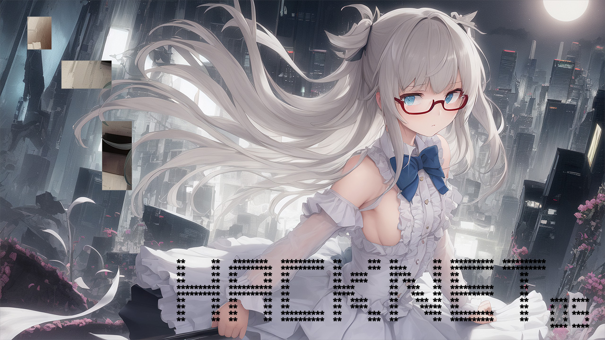
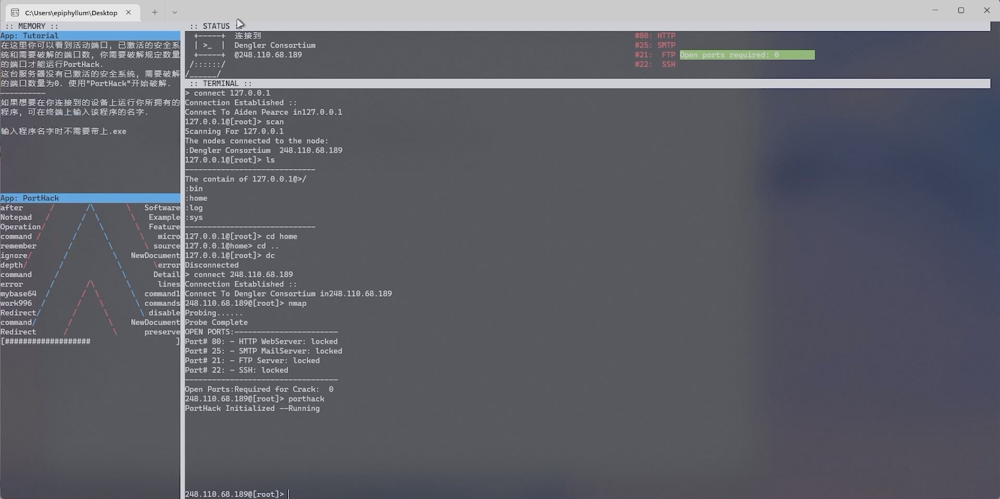
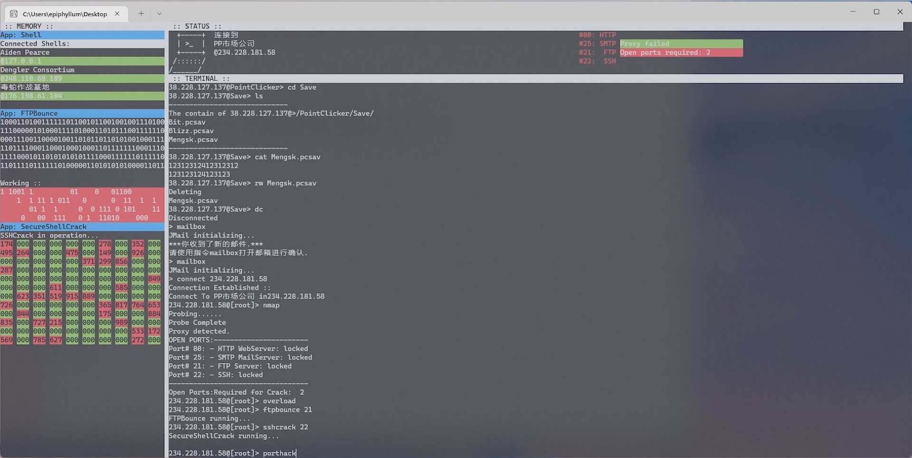
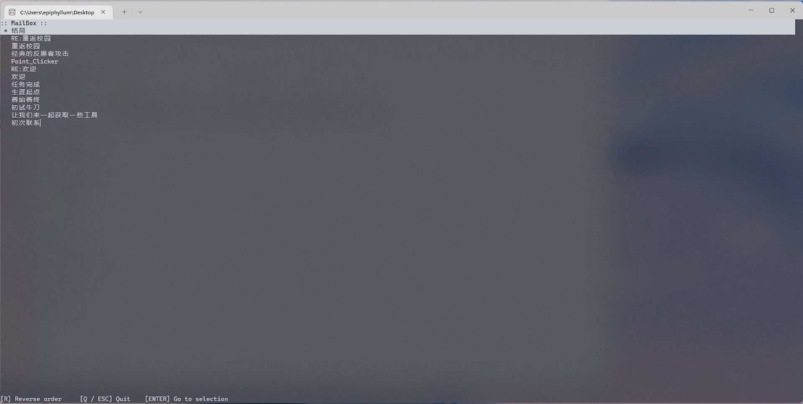

# HacknetOS

[](web/cover.png)

_cover created by Stable Diffusion + Anything v4.5_

[](https://github.com/hv0905/HacknetOS/actions/workflows/Build.yml)
[](https://github.com/hv0905/HacknetOS/releases)

A pure C++ command-line version of the original [Hacknet](https://hacknet-os.com) game.

[中文文档](readme_cn.md)

## ✨ Features

- Hacker game on pure C++ console
- UN*X like sandbox game environment.
- Unique ASCII-based hacking animation for every tool.

## ✈️ Try it

### Download & Run

Download the newest build from the [Release](https://github.com/hv0905/HacknetOS/releases) page or from
our [continuous integration](https://github.com/hv0905/HacknetOS/actions/workflows/Build.yml).

Then execute `HacknetOS.exe` directly, we suggest run the game
on [Windows Terminal](https://apps.microsoft.com/store/detail/windows-terminal/9N0DX20HK701?hl=en-us&gl=US) for a better
experience.

You have to set the size of the console to at lease 220 x 50 characters to execute the game correctly. If your screen is
too small to display full of the game, consider reducing the font size or DPI scaling settings.

Currently, some part of the game supports Chinese only, the i18n is on the way, stay tuned!

### Enable BGM Feature

> This step is optional, the game can work properly without BGM feature.

1. Purchase and download [Hacknet OST](https://store.steampowered.com/app/408710/Hacknet_Official_Soundtrack/)
2. Run `generate_bgm.ps1` using PowerShell to generate bgm directory automatically.
3. Restart the game if started, now bgm should function properly.

## 📷 Screenshots








## 🪧 Future Plans

- Saving/Loading saves using JSON
- Isolated initial save
- More commands/ functions adapt to the original games
- multi-language/ i18n support
- cross-platform support

## 💻 Develop

This project is built by CMake. To build the project following the following steps:

1. Install necessary components: `Micorsoft Visual C++ buildtool`, `CMake`
2. Run the following command to build the project:

```shell
mkdir build && cd build # Create build dir
cmake .. # Initialize CMake project
cmake --build . # Build the project
```

> Currently, the project is only supported to be built on windows platfrom, using MSVC toolchain.(But using other
> generator such as Ninja is supported)
>
> The cross-platform support is under consideration!
>

We are strongly suggest using the following Code Editor to develop:

- CLion
- Visual Studio(With CMake workload)
- Visual Studio Code

## ❤ How to contribute

There are many ways to contribute to the project: logging bugs, submitting pull requests, reporting issues, and creating
suggestions.

Even if you have push rights on the repository, you should create a personal fork and create feature branches there when
you need them. This keeps the main repository clean, and your personal workflow cruft out of sight.

We're also interested in your feedback for the future of this project. You can submit a suggestion or feature request
through the issue tracker. To make this process more effective, we're asking that these include more information to help
define them more clearly.

## Special thanks

Scripts and ideas from: [Hacknet](https://hacknet-os.com)

Don't forget to try it if you like these type of games!

## Copyright

Copyright 2022 EdgeNeko  
Licensed under GPLv3 license.
